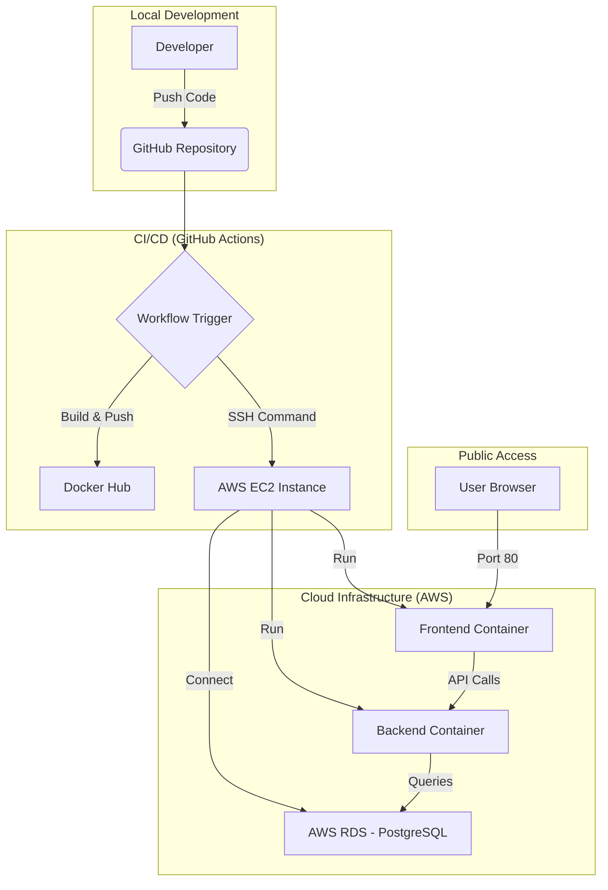

# 🚀 Study Planner: Cloud Architecture & CI/CD Workflow

This document explains the "behind the scenes" of the Study Planner project. It covers how the infrastructure is provisioned, how the code is built, and how it is deployed to the cloud.

---

## 🏗️ 1. Architecture Overview

The project uses a modern cloud-native architecture. Here is the high-level flow:

---

## 🛠️ 2. Infrastructure as Code (Terraform)

Instead of manually clicking buttons in the AWS Console, we use **Terraform** to define our infrastructure. This ensures our environment is **reproducible** and **automated**.

### Core Components:
*   **AWS EC2 (Elastic Compute Cloud):** A virtual server where our application runs. We use `Amazon Linux 2023`.
*   **AWS RDS (Relational Database Service):** A managed PostgreSQL instance. We use RDS instead of a local container for better reliability and automated backups.
*   **Security Groups:** Digital firewalls.
    *   **App SG:** Allows access to SSH (22), HTTP (80), and the backend API (8080).
    *   **RDS SG:** Only allows incoming traffic from the EC2 instance on port 5432 (Postgres), keeping the database private from the internet.
*   **User Data (Bootstrap):** When the EC2 is first created, a script runs automatically to install Docker and Docker Compose, preparing the server for our app.

---

## 🔄 3. CI/CD Pipeline (GitHub Actions)

Our deployment is fully automated. When you push to the `main` branch, the `.github/workflows/deploy.yml` kicks in.

### Step 1: Build & Push (The "CI" part)
1.  **Checkout:** Downloads the source code.
2.  **Docker Build:** Creates two images: one for the Frontend (React) and one for the Backend (Spring Boot).
3.  **Tagging:** Each image is tagged with the **Commit SHA** (unique ID) and `latest`.
4.  **Docker Hub:** Uploads the images to Docker Hub so the EC2 can pull them later.

### Step 2: Deploy (The "CD" part)
1.  **SCP:** Copies the `docker-compose.prod.yml` to the EC2 instance.
2.  **SSH:** Logs into the EC2 securely and runs a script:
    *   `docker pull`: Fetches the latest images from Docker Hub.
    *   `docker compose up`: Restarts the containers with the new versions.
    *   `docker image prune`: Cleans up old, unused images to save disk space.

---

## 🐳 4. Production Runtime (Docker Compose)

On the server, we use `docker-compose.prod.yml` to manage our services:

1.  **Frontend (React + Nginx):**
    *   Serves the static React files.
    *   Listens on port **80** (standard HTTP).
2.  **Backend (Spring Boot):**
    *   Runs the Java application.
    *   Connects to the **RDS PostgreSQL** using environment variables.
    *   Listens on port **8080**.

---

## 🔒 5. Security Best Practices

*   **Secrets Management:** Sensitive data (AWS keys, database passwords, Docker Hub tokens) are never stored in code. They are stored in **GitHub Actions Secrets**.
*   **Environment Variables:** The application reads configuration from a `.env.production` file generated dynamically by Terraform or the CI/CD pipeline.
*   **Network Isolation:** The database is in a private network (via Security Groups) and cannot be accessed directly from the outside world.

---

## 💡 Demo Talking Points for your Teacher:
1.  **Automation:** "We don't manually deploy. Every push to main is a live update."
2.  **Scalability:** "Because we use Docker, we can easily move this to a bigger server or a cluster like Kubernetes in the future."
3.  **Security:** "Notice how the database is locked down and only the application server can talk to it."
4.  **Terraform:** "The entire infrastructure can be destroyed and rebuilt in minutes with a single command."
